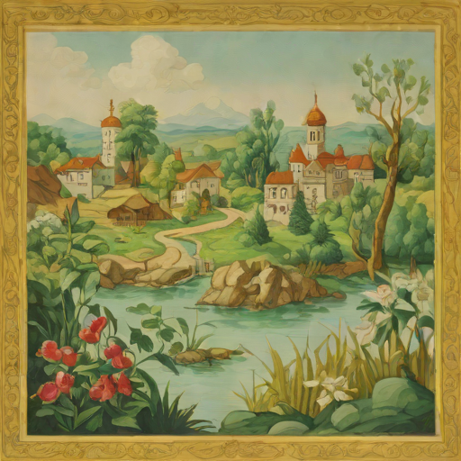

# 🧙‍♂️ Мультиагентный генератор волшебных сказок по Пути Героя Кэмпбелла

> Сочиняем сказки с помощью **трёх ИИ-агентов**, **структуры Кэмпбелла**, **изображений в стиле акварели** и (опционально) **видео через SVD-XT**.


*Пример иллюстрации в стиле импрессионизма*

---

## 🌟 О чём проект?

Это **мультиагентная система**, которая:
- Сочиняет **полноценную волшебную сказку** по 10 этапам Пути Героя (по Джозефу Кэмпбеллу)
- Использует **три агента**: Рассказчик, Ребёнок-слушатель, Редактор
- Генерирует **акварельные иллюстрации** с помощью **SDXL-Turbo**
- (Опционально) создаёт **5-секундные видео** с помощью **Stable Video Diffusion XT 1.1**
- Полностью на **русском языке**
- Работает **локально** на CPU/GPU

> ✨ Как в сказке: "Жили-были три ИИ — и вместе сочинили историю…"

---

## 📜 Пример сюжета

**Тема**: *«Царевну похитил змей, и добрый молодец отправляется её спасать»*

Система проходит все этапы:
1. Обычный мир  
2. Призыв к приключению  
3. Отказ от призыва  
4. Встреча с наставником  
5. Переход порога  
6. Испытания, союзники, враги  
7. Подземелье  
8. Кульминация  
9. Вознаграждение  
10. Возвращение с даром

---

## 🧠 Как это работает?

### 1. **Мультиагентная архитектура**
- **Рассказчик** — ведёт повествование в стиле народной сказки
- **Ребёнок** — задаёт вопросы, просит изменить, добавляет эмоций
- **Редактор** — проверяет логику, последовательность, устраняет противоречия

> Агенты общаются между собой, как в живом диалоге.

### 2. **Цепочки рассуждений (Chain-of-Thought)**
Каждый агент сначала *думает*, потом отвечает:
```
Мысль: Нужно показать, что герой боится, но идёт вперёд → Добавлю внутреннюю борьбу
Ответ: Иван сжал кулаки и шагнул на мост…
```

### 3. **Генерация медиа**
- **Изображения**: SDXL-Turbo, стиль — акварель, импрессионизм
- **Видео**: Stable Video Diffusion (img2vid-xt-1-1), 5 секунд, на основе иллюстраций
- Промпт для изображений и видео — **первые 70 слов текста главы**

### 4. **Структура сказки**
Основана на:
- **Путь героя** (Кэмпбелл)
- **Функции сказки** (Пропп)
- **Сказочные клише** («в некотором царстве», «скакал по чистому полю»)

---

## 🛠️ Технологии

| Компонент | Используется |
|---------|-------------|
| LLM | `Qwen/QwQ-32B` или `qwen:14b-chat-q4_K_M` (Ollama) |
| Агенты | `Ollama` + Python |
| Иллюстрации | `stabilityai/sdxl-turbo` |
| Видео | `stabilityai/stable-video-diffusion-img2vid-xt-1-1` |
| Архитектура | Мультиагентная система с диалогом и памятью |

---

## 🚀 Запуск

### 1. Установка зависимостей

```bash
pip install ollama torch diffusers accelerate pillow moviepy
```

### 2. Установка Ollama

👉 [https://ollama.com](https://ollama.com)

Загрузите и установите. Затем:

```bash
ollama run qwen:14b-chat-q4_K_M
```

> Или замените на `qwen:32b` при наличии мощного GPU.

### 3. Запуск проекта

```bash
python tale.py
```

### 4. С видео (опционально)

```bash
python tale.py --generate-video
```

> ⚠️ Требуется GPU с **24+ ГБ VRAM** (A100, H100). На 12 ГБ — может не хватить памяти.

---

## 🖼️ Пример вывода

После каждого этапа:
1. Выводится **текст сказки**
2. Генерируется и **отображается иллюстрация**
3. (Если включено) — **создаётся видео**

```
============================================
5. ПЕРЕХОД ПОРОГА
============================================

📖 ТЕКСТ СКАЗКИ:
Перед ними встал Чёрный мост через Пропасть Забвения...
(полный текст)

🖼️ Просмотр изображения:
[Отображается картинка в Colab / сохраняется в static/]

🎥 Генерация видео: Перед ними встал Чёрный мост через Пропасть...
✅ Видео сохранено: static/video_stage_5.mp4
```

---

## 💾 Структура проекта

```
tale-generator/
├── tale.py        # Основной скрипт
├── README.md                # Этот файл
├── requirements.txt         # Зависимости
├── static/                  # Генерируемые файлы
│   ├── stage_1.png
│   ├── ...
│   ├── video_stage_1.mp4
│   └── ...
└── example.png              # Пример иллюстрации
```

---

## 🖼️ Примеры иллюстраций

| Этап | Описание |
|------|--------|
| Переход порога | Мост над пропастью, туман, голоса страха |
| Кульминация | Битва с трёхголовым змеем |
| Возвращение | Герой идёт домой, неся свет |

Стиль: **акварель, импрессионизм, мягкие цвета, детская книжка**

---

## 📌 Требования

| Компонент | Минимум | Рекомендуется |
|---------|--------|--------------|
| CPU | i5 (12-го поколения) | i7 / i9 |
| RAM | 16 ГБ | 32–64 ГБ |
| GPU | RTX 3060 | RTX 4090 / A100 |
| VRAM | 8 ГБ | 24 ГБ+ (для SVD-XT) |
| ОС | Windows, Linux, macOS | — |

> 🔹 Без `--generate-video`: работает даже на **RTX 4070 (12 ГБ)**  
> 🔹 С видео: нужен **A100 или H100**

---

## 🎁 Возможные улучшения

- [ ] Веб-интерфейс на Gradio
- [ ] Аудио-озвучка (TTS)
- [ ] Экспорт в PDF с иллюстрациями
- [ ] Поддержка нескольких языков
- [ ] Автозагрузка в Google Drive

---

## 🙌 Автор

Сделано с ❤️ для тех, кто верит в сказки —  
и в то, что ИИ может быть не только умным,  
но и добрым.

---

## 📄 Лицензия

MIT